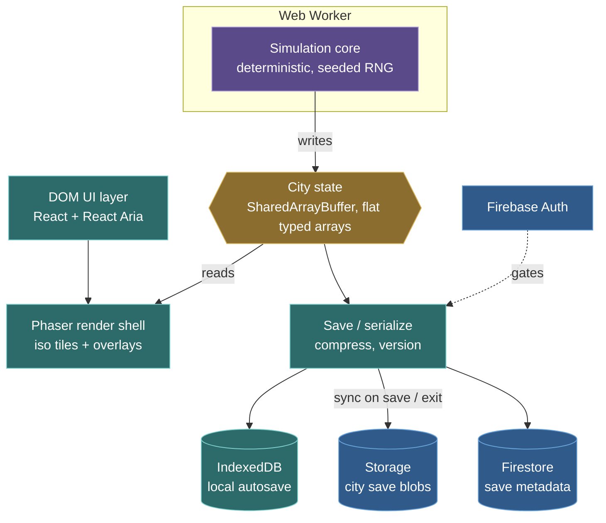
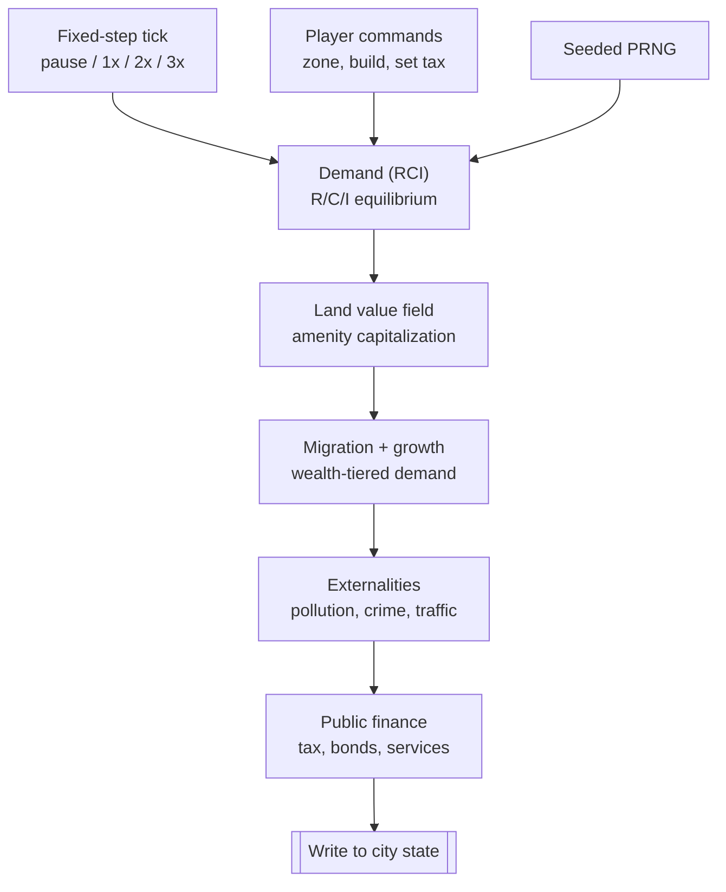

# Economic City Simulator

An open-source, web-based economic city builder in the spirit of SimCity 4, used as
a playable model of urban economics (RCI demand, land-value capitalization,
agglomeration, externalities, public finance). The simulation, not the graphics, is
the point.

## Goals

- A deterministic economic simulation that is interesting to reason about and easy to test.
- Make economic concepts *visible* (land value, demand, pollution as map overlays and charts).
- Make land-use and urbanist levers (parking, transit, density, mixed-use) visible and testable.
- Run entirely in the browser, hosted as a static site, with optional accounts and cloud saves.
- Accessible UI (keyboard navigation, screen-reader support) over the canvas.

## Non-goals (for the MVP)

- High-end graphics. The bar is roughly SimCity 3000 / IsoCity: 2D isometric, sprite-based.
- Multiplayer or real-time shared worlds.
- Mobile-first design.

## Architecture



Colour marks the layer: teal nodes run on the **main thread**, the purple node is the
**Web Worker**, amber is the **shared state**, and blue is the **Firebase cloud** backend.

Three decisions drive everything:

1. **The simulation core is a standalone, engine-agnostic, deterministic TypeScript
   package.** It has zero dependency on Phaser, the DOM, or anything visual. This makes
   it unit-testable headless, runnable in a worker, and portable if the rendering engine
   is ever swapped. It is the real asset; the shell and cloud are interchangeable.

2. **The sim runs in a Web Worker; city state lives in a SharedArrayBuffer.** The worker
   writes state, the render shell and save layer read it on the main thread, zero-copy.
   This keeps the expensive per-tick economic work off the thread that has to render and
   stay responsive.

3. **Phaser is a thin render shell.** It handles camera, input, scenes, asset loading,
   and the loop. Isometric tiles are placed with a custom grid-to-screen transform and
   `x + y` depth sort, because Phaser's accelerated tilemap is orthographic-only. The
   shell also draws scalar fields (land value, pollution) as heatmap overlays.

## Simulation core

A fixed-step clock drives an ordered pipeline of systems. The same systems run in the
same order every tick, reading a seeded PRNG (never `Math.random`). This determinism is
what makes the economics testable, bugs reproducible, and replay possible later.



The land-value field is the most expensive system (it diffuses amenity and disamenity
values across the grid) and the conceptual centerpiece (the model is accidentally
Georgist: land value is first-class and capitalizes nearby effects).

## Urbanist levers (make the YIMBY argument playable)

The sharpest pedagogical value is where the classic SimCity model diverges from how cities
actually work: hard-coded Euclidean zoning, forced R/C/I separation, density caps, and
parking treated as invisible. Rather than just reproduce that rigidity, the levers behind
the modern land-use argument should be first-class, toggleable, and measurable:

- **Parking:** model the land parking consumes (parking minimums vs none, surface lots vs
  structured). Surface it as an overlay so parking craters and the land value they suppress
  are visible.
- **Transit:** transit access as an amenity that capitalizes into nearby land value, with
  ridership and mode share responding to density and to congestion pricing.
- **Density and mixed-use:** allow lifting density caps and mixing R/C/I against the
  Euclidean baseline, so "missing middle" and walkability effects are observable.
- **Congestion pricing and induced demand:** roads vs pricing as competing levers on
  traffic and mode share.

Each lever must be (a) visible as a map overlay or chart, and (b) testable. Because the sim
is deterministic, the urbanist argument becomes regression-style assertions on the model:
"adding a transit stop raises adjacent land value within N ticks," "removing parking
minimums increases buildable density," "congestion pricing shifts mode share toward
transit." Toggling a lever and measuring the delta is the playable form of the argument.

## Data model

City state is a set of flat typed arrays, one per layer, length `width * height`, indexed
`y * width + x`. No per-tile objects. Cache-friendly, trivially serializable, fast to
iterate for the tick.

Current layers (extensible): `terrain` (u8), `zoning` (u8), `building` (u16), `roads`
(u8). Economic layers (`land_value` u16, `pollution`, etc.) are added as the sim grows.
Aggregate state (treasury, RCI demand levels, tax schedule, tick count, RNG state) lives
alongside the grid.

## Persistence

Local and cloud, layered:

- **IndexedDB** is the local working copy and frequent autosave. Async, large, binary.
  (Not `localStorage`: too small, synchronous, strings only.)
- **Firebase** is the durable, cross-device, account-linked copy, synced on checkpoints
  (manual save, session end), not every tick.

Save format is a versioned binary container:

```
[ "CITY" magic (4) ][ headerLen u32 LE (4) ][ header JSON ][ gzipped payload ]
```

- The header is stored **uncompressed** so a load-game menu can read name/stats from the
  first few KB without inflating the multi-MB grid.
- The payload is the concatenated layer buffers, gzipped (~90x smaller on a typical map
  via `CompressionStream`).
- The header is validated with zod on load; a `version` field drives forward migrations
  so format changes never brick old saves.
- In the cloud: the **blob goes in Firebase Storage**, the **metadata goes in Firestore**.
  Never put the multi-MB blob in a Firestore document.

## Tech stack

- **Language:** TypeScript throughout.
- **Render shell:** Phaser 4.
- **UI:** React + React Aria (accessible menus, dialogs, toolbars), layered over the canvas as DOM.
- **Sim core:** standalone TypeScript package, engine-agnostic.
- **Tooling:** Vite, Vitest, Biome, zod.
- **Backend:** Firebase (Auth, Firestore, Storage). Static hosting with COOP/COEP headers.
- **Maps/content:** Tiled (JSON export) for authored content.

## Constraints and gotchas

- **SharedArrayBuffer requires cross-origin isolation** (COOP + COEP response headers).
  A hosting config requirement, not optional.
- **Workers share bytes, not objects.** Only typed arrays in the SharedArrayBuffer cross
  the thread boundary; this is why state is flat arrays, not an object graph.
- **Phaser tilemaps are orthographic-only**, so isometric placement is custom code.
- **Endianness:** the u16 layers are written in native byte order (fine on all realistic
  little-endian targets; revisit only if a big-endian target ever matters).

## Open decisions

- **Cloud sync conflict strategy.** MVP: last-write-wins with a "cloud copy is newer"
  check. Revisit if multi-device editing becomes common.
- **Concurrency headroom.** One sim worker is enough for the MVP. A worker pool (sized to
  `navigator.hardwareConcurrency`) or a Rust/WASM core could parallelize later; the
  land-value diffusion is a natural fit for a WebGPU compute shader if it ever bottlenecks.

## First milestone

A headless, unit-tested spike of the sim core: a deterministic fixed-step tick loop plus
a first-pass RCI demand model with its feedback loop, before any of it touches Phaser.
